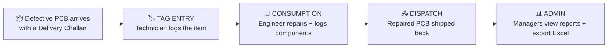
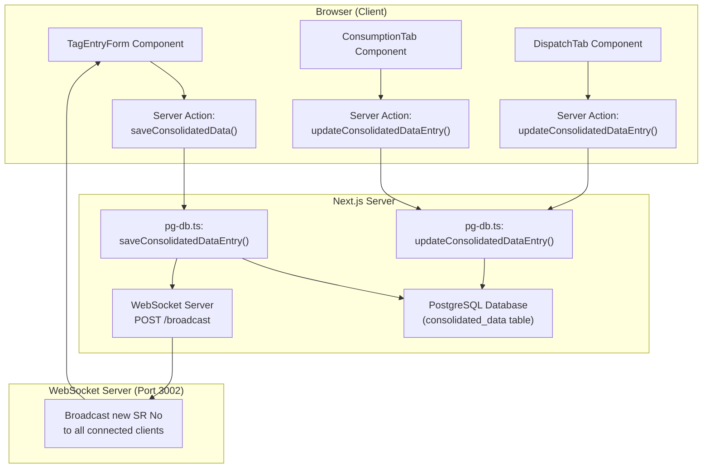

# NexScan — Complete Software Walkthrough

## What Is This Software?

**NexScan** is a **PCB (Printed Circuit Board) Repair Tracking System** built for **Bajaj Electricals**. It replaces a manual Excel-based workflow where technicians used to fill in handwritten paper forms and someone would later type the data into spreadsheets.

### The Real-World Problem It Solves

Bajaj Electricals manufactures consumer electronics like **induction cooktops** (e.g., ICX 190, Splendid 120, IRX 220F). When a customer's product breaks, the defective PCB is sent to a repair center via a **Delivery Challan (DC)**. At the repair center, the PCB goes through 3 stages:

1. **Tag Entry** — A technician receives the PCB, records details from the handwritten paper form (customer info, complaint, serial numbers, etc.), and tags it.
2. **Consumption (Repair)** — An engineer opens up the PCB, diagnoses the fault, replaces broken components, and records what was done.
3. **Dispatch** — The repaired PCB is sent back, and the dispatch details are logged.

Previously, all of this was tracked in **Excel sheets**. NexScan digitizes this entire workflow.

---

## Technology Stack

| Layer | Technology | Purpose |
|-------|-----------|---------|
| **Frontend** | Next.js 16 + React 18 + TypeScript | UI pages and components |
| **Styling** | Tailwind CSS + Radix UI (shadcn/ui) | Design system and accessible components |
| **Backend** | Next.js Server Actions + API Routes | Business logic, database queries |
| **Database** | PostgreSQL (local / Neon for cloud) | Persistent data storage |
| **Auth** | Supabase (optional) + JWT via `jose` | User authentication |
| **AI / OCR** | Google Genkit + Gemini AI | Extract data from photos of handwritten forms |
| **Real-time** | WebSocket server ([ws-server.js](file:///c:/Users/Ranjit Kadam/Documents/Electrolyte/ws-server.js)) | Live SR No synchronization across all open tabs |
| **State Mgmt** | Zustand | Client-side state (lock store for DC/PartCode) |
| **Excel Export** | ExcelJS | Generate downloadable `.xlsx` reports |

---

## The Repair Workflow (How the App Maps to Real Life)



---

## Page-by-Page Breakdown

### 1. Login Page (`/login`)
**File:** [page.tsx](file:///c:/Users/Ranjit Kadam/Documents/Electrolyte/src/app/login/page.tsx)

**What it does:**
- User enters their email + password.
- User also selects a **DC Number** and **Part Code** from dropdowns. These get "locked" for the entire session (so you don't have to re-select them for every entry).
- If the user is an **ADMIN**, they skip DC/PartCode selection and go directly to the Admin Panel.
- If they are a regular **USER**, they go to the main dashboard.

**Why it exists:** Controls who can access the system and pre-sets the working context (which DC and product they're processing today).

---

### 2. Signup Page (`/signup`)
**File:** [signup/page.tsx](file:///c:/Users/Ranjit Kadam/Documents/Electrolyte/src/app/signup/page.tsx)

**What it does:** Allows new users to create an account with email, password, and name.

---

### 3. Forgot / Reset Password Pages (`/forgot-password`, `/reset-password`)
**What they do:** Standard password recovery flow via email (requires Supabase to be configured).

---

### 4. Main Dashboard / Home Page (`/`)
**File:** [page.tsx](file:///c:/Users/Ranjit Kadam/Documents/Electrolyte/src/app/page.tsx) — **1,026 lines, the largest page**

This is the main working area for technicians and engineers. It contains **5 tabs** across the top:

#### Tab 4.1: Tag Entry (Default Tab)
**Component:** [TagEntryForm.tsx](file:///c:/Users/Ranjit Kadam/Documents/Electrolyte/src/components/tag-entry/TagEntryForm.tsx) — 1,136 lines

**What it does:**
- The technician fills in a form with details from the handwritten paper form: Branch, BCCD Name, Product Sr No, Complaint No, Defect, Visiting Tech Name, Mfg Month/Year.
- **SR No is auto-assigned** atomically by the server (prevents duplicates when multiple people save at the same time).
- **PCB Sr No is auto-generated** from the Part Code + SR No using a formula (e.g., `ES9710390F260001R`).
- The DC Number and Part Code are **locked** from the login session.
- Has **keyboard shortcuts**: Alt+S (Save), Alt+C (Clear), Alt+D (Delete), Alt+U (Update).
- Can **search** existing entries by DC No, Complaint No, Product Sr No, or PCB Sr No.

**AI Feature:** There's an **Image Uploader** component that lets you take a photo of a handwritten form. It uses **Google Gemini AI** to automatically extract the text into the form fields (OCR).

#### Tab 4.2: Consumption
**Component:** [ConsumptionTab.tsx](file:///c:/Users/Ranjit Kadam/Documents/Electrolyte/src/components/tag-entry/ConsumptionTab.tsx) — 55,393 bytes (the largest component)

**What it does:**
- After a PCB has been tagged, an engineer opens this tab to record the **repair details**.
- They search for the entry by PCB Sr No or Product Sr No.
- They fill in: Repair Date, Testing (PASS/FAIL), Failure type, Analysis, Component Change, Status (OK/NFF/SCRAP), and their Engineer Name.
- **Component validation** happens against the BOM (Bill of Materials) table — if the engineer enters a component location like "R1", the system checks if that component actually exists on the PCB for that part code.

#### Tab 4.3: Dispatch
**Component:** [DispatchTab.tsx](file:///c:/Users/Ranjit Kadam/Documents/Electrolyte/src/components/tag-entry/DispatchTab.tsx)

**What it does:**
- After repair, the PCB is dispatched (shipped back).
- The dispatch operator searches for the entry and records the **Dispatch Date** and their name.

#### Tab 4.4: Search PCB
**Component:** [SearchPCBTab.tsx](file:///c:/Users/Ranjit Kadam/Documents/Electrolyte/src/components/tag-entry/SearchPCBTab.tsx)

**What it does:**
- A lookup tool to search for any PCB by its Sr No, Product Sr No, or Complaint No.
- Shows the full history and current status of the item.

#### Tab 4.5: Bulk Scrap
**Component:** [BulkScrapTab.tsx](file:///c:/Users/Ranjit Kadam/Documents/Electrolyte/src/components/tag-entry/BulkScrapTab.tsx)

**What it does:**
- Allows marking multiple PCBs as "SCRAP" at once (batch operation).
- Used when multiple items are beyond repair.

---

### 5. Admin Dashboard (`/admin`)
**File:** [admin/page.tsx](file:///c:/Users/Ranjit Kadam/Documents/Electrolyte/src/app/admin/page.tsx) — 656 lines

**What it does:**
- Only accessible to users with `role = 'ADMIN'`.
- Shows a beautiful dark-themed dashboard with **3 analytics tabs**:
  1. **Users Tab** — How many tag entries and consumption entries each person made on a given date.
  2. **Part Code Tab** — Entry counts grouped by part code.
  3. **DC Number Tab** — Entry counts grouped by DC number.
- Has a **date picker** to view data for any specific day, or "Overall" for all-time totals.
- Has an **Export Excel** button that generates a downloadable `.xlsx` file of all the data, optionally filtered by DC Number.

---

## How Data Flows Through the System



---

## Real-Time SR No Sync (WebSocket)

**File:** [ws-server.js](file:///c:/Users/Ranjit Kadam/Documents/Electrolyte/ws-server.js)

**Why it exists:** If 5 technicians are all doing Tag Entry at the same time, they need to see the **next available SR No** in real time. Without this, two people might try to save with the same SR No.

**How it works:**
1. A standalone WebSocket server runs on **port 3002** alongside the Next.js app on port 3001.
2. When any browser tab opens the Tag Entry form, it connects to the WebSocket server.
3. The server immediately sends the current "next SR No" to the new client.
4. When someone saves an entry, the Next.js server action calls `POST /broadcast` on the WebSocket server.
5. The WebSocket server queries the database for the new max SR No and broadcasts it to **all connected clients**.
6. Every open Tag Entry form instantly updates its SR No field.

**Hook:** [useRealtimeSrNo.ts](file:///c:/Users/Ranjit Kadam/Documents/Electrolyte/src/hooks/useRealtimeSrNo.ts) — The React hook that manages the WebSocket connection in the browser.

---

## AI / OCR Feature (Google Genkit + Gemini)

**Files:**
- [extract-data-from-handwritten-form.ts](file:///c:/Users/Ranjit Kadam/Documents/Electrolyte/src/ai/flows/extract-data-from-handwritten-form.ts)
- [form-extraction-schemas.ts](file:///c:/Users/Ranjit Kadam/Documents/Electrolyte/src/ai/schemas/form-extraction-schemas.ts)

**How it works:**
1. User uploads/takes a photo of a handwritten repair form.
2. The image is sent as a base64 data URI to a Genkit flow.
3. The flow sends the image to **Google Gemini AI** with a prompt asking it to extract: Branch, BCCD Name, Product Sr No, Complaint No, Defect, etc.
4. Gemini returns structured JSON data.
5. The form fields are auto-populated with the extracted data.

> [!NOTE]
> This requires a `GOOGLE_API_KEY` environment variable to work. Without it, the AI extraction feature will fail.

---

## Folder Structure Map

```
src/
├── ai/                          # AI/ML features
│   ├── flows/                   # Genkit AI flows (OCR extraction, translation)
│   ├── schemas/                 # Zod schemas for AI input/output
│   └── genkit.ts                # Genkit configuration
│
├── app/                         # Next.js App Router pages
│   ├── page.tsx                 # Main dashboard (1,026 lines)
│   ├── layout.tsx               # Root layout (AuthProvider, Toaster)
│   ├── login/                   # Login page
│   ├── signup/                  # Signup page
│   ├── admin/                   # Admin dashboard
│   ├── forgot-password/         # Password recovery
│   ├── reset-password/          # Password reset
│   ├── actions/                 # Server actions (the "backend" logic)
│   │   ├── consumption-actions.ts  # Save/update/delete repair data
│   │   ├── admin-actions.ts        # Admin analytics queries
│   │   ├── sheet-actions.ts        # Sheet CRUD operations
│   │   ├── db-actions.ts           # DC number management
│   │   └── image-actions.ts        # Image processing
│   └── api/                     # REST API routes
│       ├── auth/                # Login, signup, logout, me, password reset
│       ├── dc-numbers/          # DC number CRUD
│       ├── engineers/           # Engineer name management
│       ├── export-excel/        # Excel file generation
│       └── export-consumption-excel/
│
├── components/                  # React UI components
│   ├── tag-entry/               # The 5 main tab components
│   │   ├── TagEntryForm.tsx     # Tag Entry form (1,136 lines)
│   │   ├── ConsumptionTab.tsx   # Repair/consumption form
│   │   ├── DispatchTab.tsx      # Dispatch form
│   │   ├── SearchPCBTab.tsx     # PCB lookup
│   │   ├── BulkScrapTab.tsx     # Bulk scrap operation
│   │   ├── SettingsTab.tsx      # DC/PartCode management
│   │   ├── FindTab.tsx          # Entry search
│   │   └── TagEntryPreview.tsx  # Preview dialog
│   ├── ui/                      # Reusable UI primitives (shadcn/ui)
│   ├── UserProfile.tsx          # User avatar + name display
│   └── image-uploader.tsx       # Camera/upload component for AI OCR
│
├── contexts/                    # React Context providers
│   └── AuthContext.tsx           # Authentication state management
│
├── hooks/                       # Custom React hooks
│   └── useRealtimeSrNo.ts       # WebSocket hook for live SR No
│
├── lib/                         # Core business logic & utilities
│   ├── pg-db.ts                 # PostgreSQL database layer (1,680 lines!)
│   ├── auth/auth-service.ts     # Authentication logic (Supabase + local)
│   ├── pcb-utils.ts             # PCB serial number generation formula
│   ├── tag-entry/               # Tag entry utilities and export
│   ├── sheet-service.ts         # Sheet CRUD service
│   ├── consumption-validation-service.ts  # BOM validation
│   ├── dc-data-sync.ts          # DC number sync utilities
│   └── spare-parts.ts           # Part code → description mapping
│
├── store/                       # Zustand state stores
│   └── lockStore.ts             # DC Number + Part Code lock state
│
└── firebase/                    # Firebase configuration (partially used)

ws-server.js                     # Standalone WebSocket server for real-time SR No sync
```

---

## Key Files You'll Touch Most Often

| File | Lines | What it controls |
|------|-------|-----------------|
| [pg-db.ts](file:///c:/Users/Ranjit Kadam/Documents/Electrolyte/src/lib/pg-db.ts) | 1,680 | **All database queries** — every read/write goes through here |
| [page.tsx (home)](file:///c:/Users/Ranjit Kadam/Documents/Electrolyte/src/app/page.tsx) | 1,026 | Main dashboard, tab routing, sheet management |
| [TagEntryForm.tsx](file:///c:/Users/Ranjit Kadam/Documents/Electrolyte/src/components/tag-entry/TagEntryForm.tsx) | 1,136 | The primary data entry form |
| [ConsumptionTab.tsx](file:///c:/Users/Ranjit Kadam/Documents/Electrolyte/src/components/tag-entry/ConsumptionTab.tsx) | ~1,400 | Repair/consumption workflow |
| [admin/page.tsx](file:///c:/Users/Ranjit Kadam/Documents/Electrolyte/src/app/admin/page.tsx) | 656 | Admin analytics dashboard |
| [consumption-actions.ts](file:///c:/Users/Ranjit Kadam/Documents/Electrolyte/src/app/actions/consumption-actions.ts) | ~400 | Server-side save/update/delete logic |
| [auth-service.ts](file:///c:/Users/Ranjit Kadam/Documents/Electrolyte/src/lib/auth/auth-service.ts) | 410 | Authentication & user management |
| [ws-server.js](file:///c:/Users/Ranjit Kadam/Documents/Electrolyte/ws-server.js) | 143 | Real-time WebSocket server |
